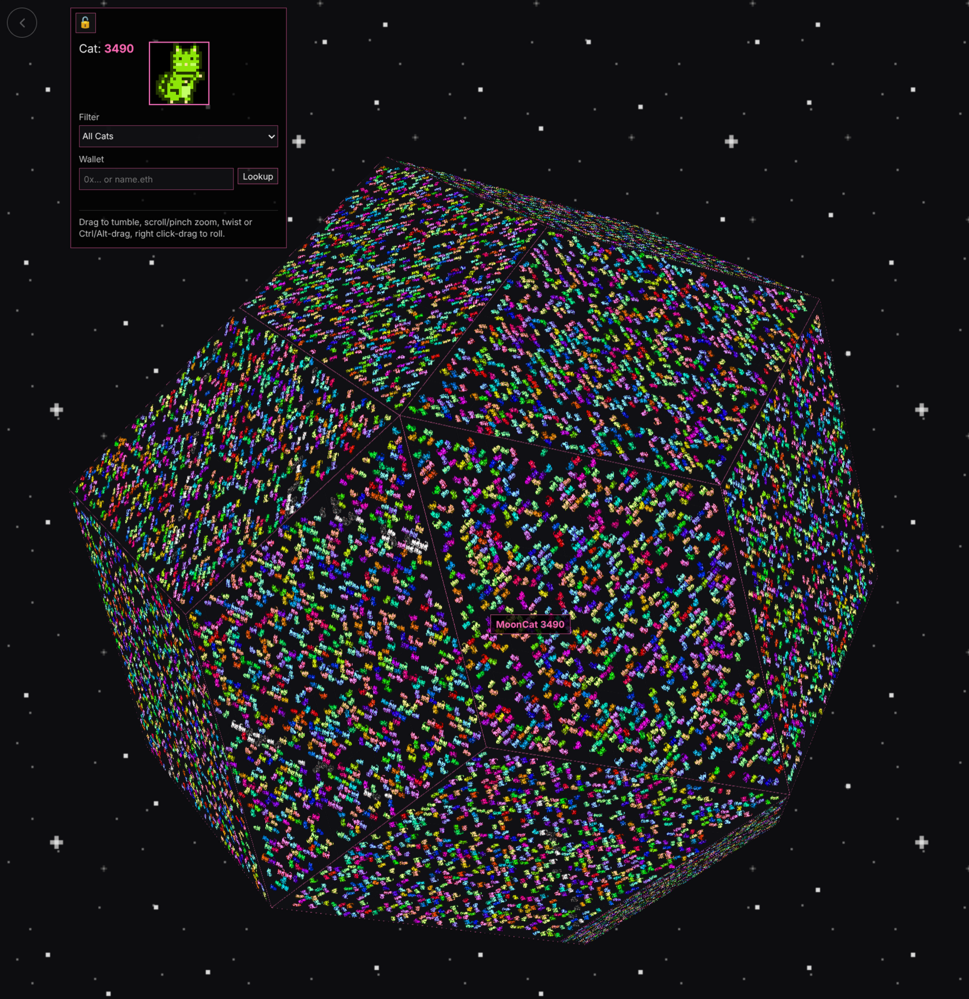

# CatMoon



CatMoon is an interactive 3D MoonCat viewer. It places all **25,440 rescued MoonCats** onto a rotating geometric moon so you can explore the collection, pin cat details, filter special rescue groups, and look up MoonCats owned by a wallet.

---

# User Guide

## Explore the CatMoon

| Action | Desktop | Mobile |
| --- | --- | --- |
| Rotate / tumble | Click and drag | Drag with one finger |
| Zoom | Mouse wheel / trackpad | Pinch |
| Roll / twist | Ctrl/Alt-drag or right-click-drag | Two-finger twist |
| Pin cat details | Click a cat | Press a cat |

CatMoon can slowly auto-tumble on its own. Manual movement pauses the motion briefly so you can inspect the moon.

## Details Panel and Toggles

The lock button in the top-left expands or collapses the settings panel.

**Locked**

- Only the lock button is shown.
- You can still rotate, zoom, filter by URL, hover, and pin cat details.
- The settings controls are hidden.

**Unlocked**

- Filters and wallet lookup are available.
- Toggle controls are available:
  - **Auto tumble**: turn automatic rotation on or off.
  - **Hover preview**: show or hide preview images in hover/pinned cards.
  - **Cat links**: allow the pinned cat image to open the cat on [mooncatrescue.com](https://mooncatrescue.com)

These toggle preferences are stored locally in your browser.

## Hover and Pinned Cat Cards

Hovering a MoonCat shows a small card near the cursor or finger. The card shows the rescue-order number, a preview image when enabled, and the cat name if the cat has been named.

Clicking or pressing a cat pins its detail card on screen:

- Click or press the same cat again to hide the pinned card.
- Click or press a different cat to replace the pinned card.
- While a card is pinned, hover cards for other cats are hidden to avoid overlap.
- While a card is pinned, auto-tumble pauses.
- If you tumble far enough away from the pinned cat, the pinned card clears automatically.

When **Cat links** is enabled, clicking the image in a pinned card opens that cat on [mooncatrescue.com](https://mooncatrescue.com)

## Filters

Use the filter dropdown to highlight groups of MoonCats.

Available filters include:

- Named Cats
- Genesis Cats
- Character Cats
- Day 1 Rescues
- Week 1 Rescues
- 2017–2021 rescue-year groups
- All Early Rescues
- Wallet Cats, after a wallet lookup

When a filter is active, matching cats stay bright and the rest of the CatMoon is dimmed. Use the active filter badge to reset back to all cats.

## Wallet Cats

CatMoon can highlight MoonCats owned by an Ethereum wallet.
This includes cats that are original, Acclimated or in the JumpPort.

Enter an address or ENS name, then press **Lookup**.

Examples:

```text
0x1234567890abcdef1234567890abcdef12345678
vitalik.eth
vitalik
cats.vitalik
cats.vitalik.eth
```

ENS shortcuts are normalized:

```text
vitalik -> vitalik.eth
cats.vitalik -> cats.vitalik.eth
cats.vitalik.eth -> cats.vitalik.eth
```

When Wallet Cats are active:

- owned cats are highlighted on the moon
- wallet cats appear slightly larger and lifted from the surface
- the active filter label shows the wallet or ENS name
- the wallet view can be bookmarked or shared

Example wallet URL:

```text
https://catmoon.zibzub.art/?wallet=vitalik.eth
```

## Wallet History and Privacy

Recent wallet lookups are stored locally in your browser.

CatMoon does not require:

- wallet connection
- account login
- signature approval

Wallet history and UI toggle settings are not synced between browsers or devices. Clearing browser storage may remove them.

---

# Technical Details

## Project Structure

CatMoon is a static Cloudflare Pages site with browser-native ES modules and a small Cloudflare Pages Function for wallet lookup.

```text
public/
  index.html
  main.js
  styles.css
  js/
    config.js
    dom.js
    utils.js
    wallet.js
    filters.js
    preview.js
    catmoon-geometry.js
    controls.js
  data/
    mooncat-filters.json
    mooncat-names.json
  img/
    allcats.png
    tri-faces/
    filters/

functions/
  api/
    wallet-cats.js

test/
  config.test.js
  utils.test.js
  wallet.test.js

tools/
  extract-mooncat-names.js
```

There is no frontend build step. `public/index.html` loads `public/main.js` directly as an ES module.

Three.js is loaded from jsDelivr through the import map in `public/index.html`.

## Local Development

Install dependencies:

```bash
npm ci
```

Run syntax checks:

```bash
npm run check
```

Run unit tests:

```bash
npm test
```

Generate the names-only MoonCat data file from a local `mooncat_traits.json` source file:

```bash
npm run build:names
```

Preview locally with Cloudflare Pages:

```bash
npx wrangler pages dev public
```

## Cloudflare Pages

Recommended Cloudflare Pages settings:

```text
Build command: npm ci
Output directory: public
```

The wallet lookup function requires an Ethereum RPC endpoint:

```text
ETH_RPC_URL=https://eth-mainnet.g.alchemy.com/v2/YOUR_KEY
```

## Wallet Lookup API

The frontend calls:

```text
/api/wallet-cats?address=...
```

The Cloudflare Pages Function lives at:

```text
functions/api/wallet-cats.js
```

It supports Ethereum addresses and ENS names. It uses `viem` for Ethereum and ENS resolution. Wallet ownership data comes from the MoonCatRescue API.

Successful wallet lookup responses are cached at the Cloudflare edge for 5 minutes. Invalid inputs return `400` with `cache-control: no-store`.

Input protection rejects missing, too-long, or unsafe lookup inputs before ENS/RPC/API work is attempted.

## Geometry

CatMoon is a **rhombic triacontahedron**:

```text
30 rhombus faces
848 MoonCats per face
25,440 total MoonCats
```

MoonCats are arranged by rescue-order ID:

```text
globalId = faceIndex * 848 + slot.id
```

Example ranges:

```text
Face 0:  IDs 0–847
Face 1:  IDs 848–1695
Face 2:  IDs 1696–2543
...
Face 29: IDs 24592–25439
```

This makes CatMoon both a visual artwork and a spatial map of the full MoonCat rescue set.

## Image Assets

Base face textures:

```text
public/img/tri-faces/tri-face-00.png
...
public/img/tri-faces/tri-face-29.png
```

Triangular face textures are generated with deterministic jittering, so the same inputs produce stable, repeatable face images.

Slot metadata:

```text
public/img/tri-faces/tri-face-slots.compact.json
```

Full MoonCat atlas:

```text
public/img/allcats.png
```

The full atlas is lazy-loaded only when needed for hover/pinned previews, named-cat overlays, or wallet overlays.

Filter overlays:

```text
public/img/filters/<filterKey>/tri-face-XX.png
public/img/filters/filter-manifest.json
```

Most built-in filters use static overlay textures. Runtime-only filters, such as Named Cats and Wallet Cats, generate overlay textures in the browser from `allcats.png` and the relevant ID set.

## Filters and Names Data

Static filter categories are defined in:

```text
public/data/mooncat-filters.json
```

Named cats are defined in a generated names-only file:

```text
public/data/mooncat-names.json
```

The source traits file is expected at the repo root when regenerating names:

```text
mooncat_traits.json
```

Run this to extract only non-empty names keyed by rescue-order ID:

```bash
npm run build:names
```

The generated names file is used for:

- displaying cat names in hover and pinned cards
- the Named Cats filter ID set
- runtime Named Cats overlay generation

The full traits file is not required by the browser app.

## UI State

The app stores lightweight preferences in browser `localStorage`, including:

```text
catmoon.walletLookupHistory
catmoon.hoverPreviewImages
catmoon.autoTumble
catmoon.catLinks
```

These settings are local to the browser and are safe to clear.

## Tests

The test suite uses Node’s built-in test runner.

Current coverage focuses on:

- config constants and URL helpers
- utility helpers
- wallet normalization and history helpers

Run:

```bash
npm test
```

## Acknowledgements

CatMoon uses MoonCat artwork/background PNG assets sourced from MoonCatRescue.com, and wallet ownership lookup data from the MoonCatRescue API. These external artwork assets are included for MoonCat visualization purposes and are not relicensed by CatMoon’s GPL-3.0-or-later license.

CatMoon was inspired by the Allcats site created by cmfb.

## License

CatMoon is licensed under **GPL-3.0-or-later**. See [LICENSE](LICENSE) for details.
